# Google Colab Non WebUI Stable Diffusion XL Image Generator

This is a simple Google Colab notebook made by an 18-years-old junior programmer for generating images using Stable Diffusion XL.

## Features Overview
- **Image Generation:** Uses Transformers and Diffusers as the major components for image generation, along with ControlNet, Inpainting, and IP-Adapter.
- **Download and Load:** Ability to download and load images, checkpoint, LoRA weights, and VAE using direct URLs.
- **Textual Inversion:** Ability to load embeddings for more output control. 
- **Image-to-Image:** Turn your images into something more creative and unique. 
- **Prompt Generator:** Generate creative prompt powered by GPT-2. (Model by [Gustavosta](https://huggingface.co/Gustavosta))
- **Image Upscaling:** Using [Real-ESRGAN](https://github.com/xinntao/Real-ESRGAN) made by [xinntao](https://github.com/xinntao) and Real-ESRGAN's contributors. 
- **Google Drive Integration:** Can connect to your Google Drive or disable it.
- **User-Friendly UI:** Simplified complexity with an easy-to-understand user interface.
- **IPyWidgets:** Simplified UI so that you don't need to scroll up and down. 
- **Built-in History System:** Can show all of your previously generated images in Google Drive without opening it, just with a few simple clicks.
- **Preset System:** Enables saving, loading, renaming, and deleting presets containing your saved parameters.
- **CivitAI Token Support:** Pass your CivitAI token for additional functionality, but remember **never share it with anyone.**
- **Hugging Face Token Support:** Pass your Hugging Face token for accessing private files, but remember **never share it with anyone.**
- **Simplicity:** Consists of two cells only.
- **IPyCanvas:** Create your own mask image for Inpainting immediately. (unstable and may introduce issues unexpectedly)

## Usage
This notebook is designed for artistic purposes and to spark inspiration. **Please use it responsibly.** Creating deepfakes and uploading them online are strictly prohibited.

## Installation
Simply open the notebook on Google Colab to start using it. No installation is needed. 

**Link:** [](https://colab.research.google.com/github/ZicoDiegoRR/stable_diffusion_xl_colab_ui/blob/main/V3.ipynb)

> [!NOTE]\
> Check out the [Legacy branch](https://github.com/ZicoDiegoRR/stable_diffusion_xl_colab_ui/tree/legacy) to use the old versions of this notebook.

## Disclaimer
- This tool is intended for creating art and exploring creative image generation.
- **Use responsibly.** Please refrain from using it for any malicious or harmful activities.
- NSFW generation is supported, but do it at your own risk.

## Feature Table
<details> <summary>Click here</summary>
  
|     | Features                                                                                                                     |
|-----|------------------------------------------------------------------------------------------------------------------------------|
| 1.  | Base pipelines and autoencoder (ControlNet, Inpainting, VAE, Text2Img)                                                       |
| 2.  | Base adapters (LoRA, IP-Adapter)                                                                                             |
| 3.  | IPyWidgets                                                                                                                   |
| 4.  | Saving and loading parameters                                                                                                |
| 5.  | Interactive UI                                                                                                               |
| 6.  | Linking widgets                                                                                                              |
| 7.  | History system                                                                                                               |
| 8.  | Upload images directly                                                                                                       |
| 9.  | Image-to-image                                                                                                               |
| 10. | Textual inversion or embeddings                                                                                              |
| 11. | Send images from history to Image-to-image, ControlNet, Inpainting, and/or IP-Adapter                                        |
| 12. | Reset button (defaulting the parameters)                                                                                     |
| 13. | Compatibility with saved parameters from previous versions                                                                   |
| 14. | Preset system (saving and loading custom parameters)                                                                         |
| 15. | GPT-2 Prompt Generator                                                                                                       |
| 16. | Hugging Face token integration                                                                                               |
| 17. | Real-ESRGAN Image Upscaling                                                                                                  |
| 18. | New parameters saving system (from a flat list to a dictionary) and a conversion method to convert old saves to the new ones |
| 19. | URL saving system to save any previously-inputted URLs into a JSON file and access them with filenames only                  |
| 20. | One model at a time for all pipelines instead of multiple models for each pipeline to avoid OutOfMemory error                |
| 21. | Preview buttons to display ControlNet's converted image                                                                      |
| 22. | `components` integration for memory-sharing between pipelines to avoid OutOFMemory error due to independent tensors          |
| 23. | Implementation of `ControlNetUnion` for better memory management and scalable approach                                       |
| 24. | Corrupted-download deletion logic                                                                                            |
| 25. | Preview buttons to display uploaded IP-Adapter's images and URLs, as well as buttons to remove them                          |
| 26. | `ipycanvas` canvas to create mask images for Inpainting (unstable)                                                           |

</details>

## Preview

<details> <summary> Text-to-image </summary>

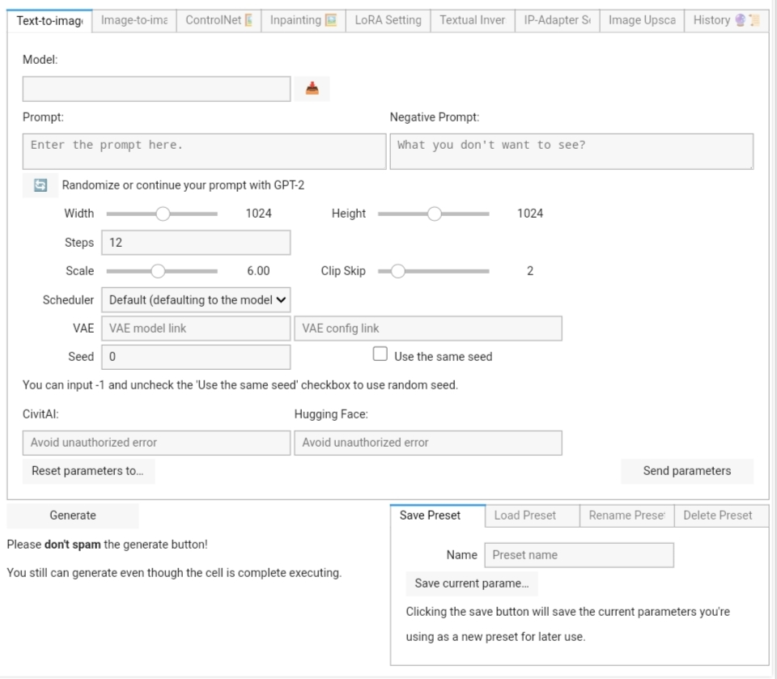

</details>

<details> <summary> Image-to-Image </summary>

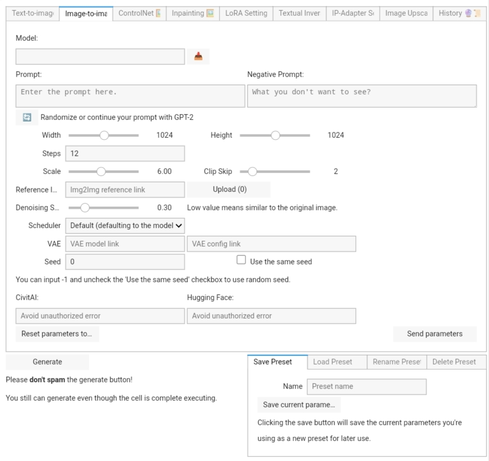

</details>

<details> <summary> ControlNet </summary>

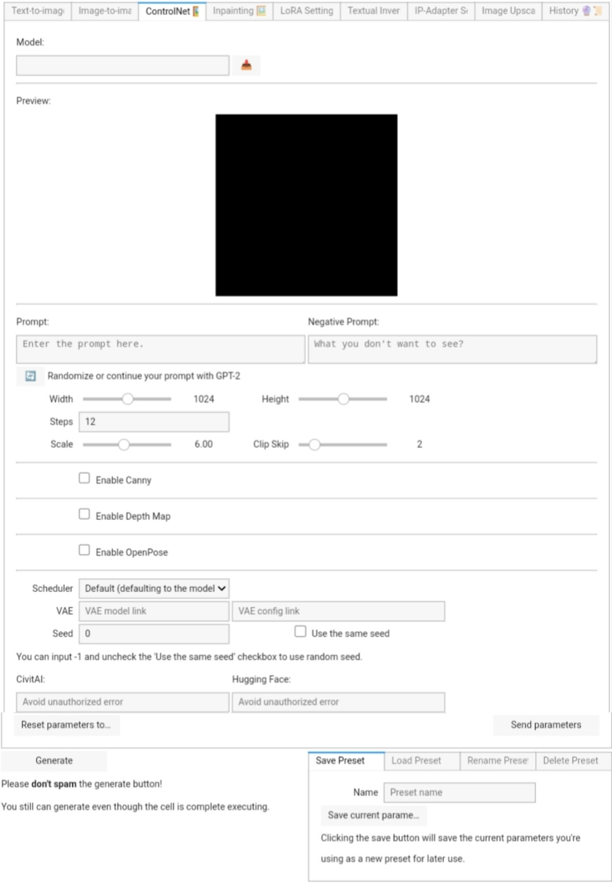

</details>

<details> <summary> Inpainting </summary>
<br>
Settings:

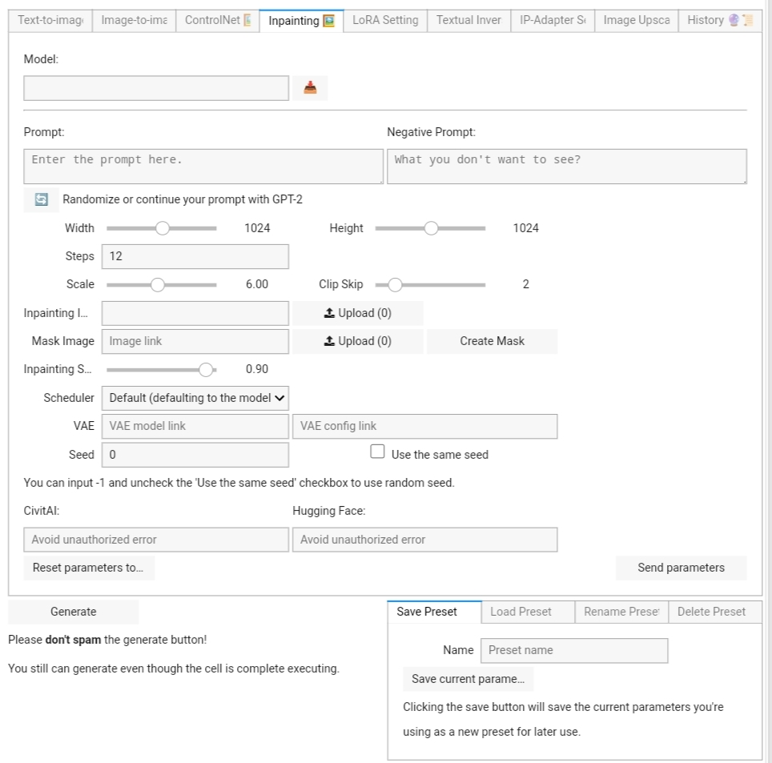

<br>
Canvas:

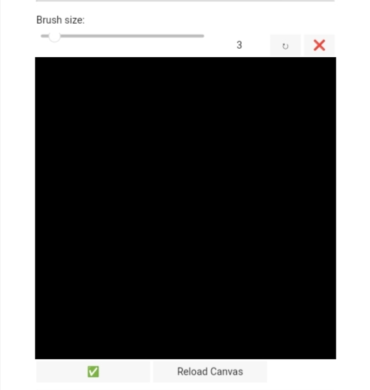

</details>

<details> <summary> LoRA </summary>

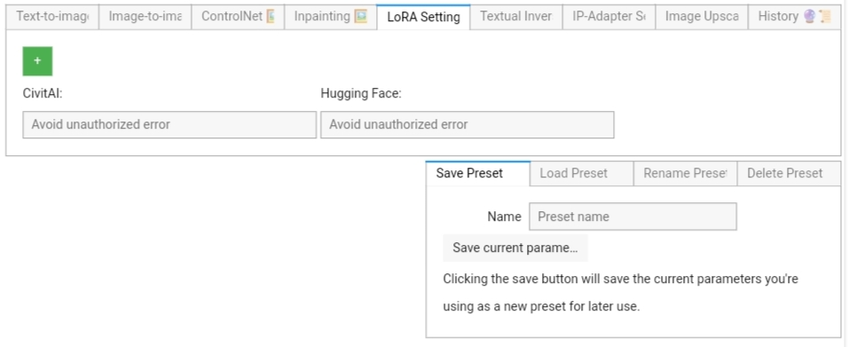

</details>

<details> <summary> Textual Inversion </summary>


</details>

<details> <summary> IP-Adapter </summary>


</details>

<details> <summary> Real-ESRGAN </summary>

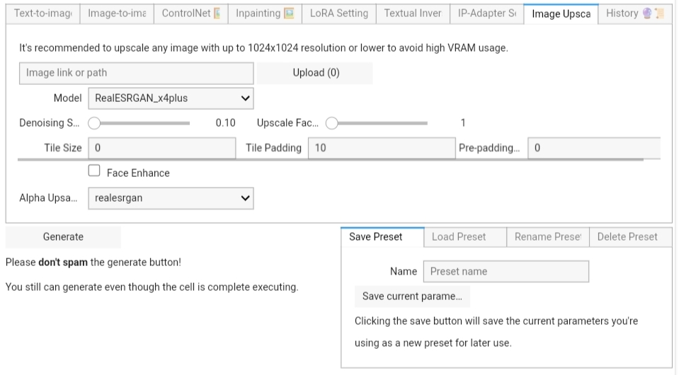

</details>

<details> <summary> History </summary>

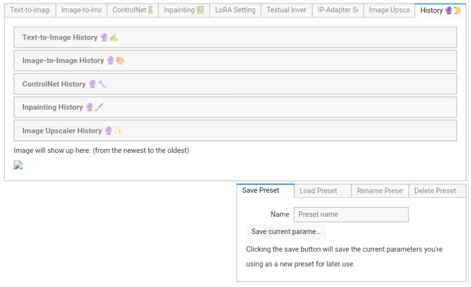

</details>

<details> <summary> Preset </summary>
  
<br>
Save:

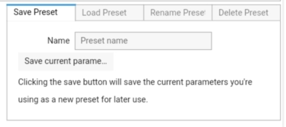

<br>
Load: 

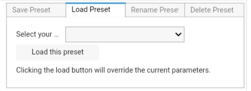

<br>
Rename: 

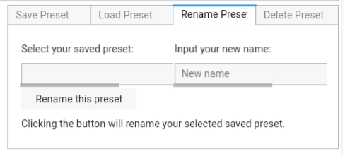

<br>
Delete: 

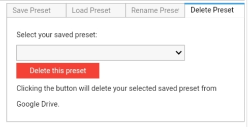

</details>


## Token Saving (Optional)
This notebook doesn't save your Hugging Face's token and CivitAI's token due to security concern. But, if you wish to save your tokens to your Google Drive or to your runtime, you can follow these steps.

> [!CAUTION]\
> **I strongly don't recommend you to save your tokens anywhere else, especially if you share your Google Drive storage with anyone. Any potential exploitation or misuse of this method won't fall under my responsibility.**

Here are the steps to save your tokens to Google Drive storage or to your runtime:
1. Open a notebook in Google Colab and create a new cell first. This step is required to run the code.
2. Copy this code and paste it into your new cell.

    ```python
    from google.colab import drive
    import json
    import os

    hf_token = "" #@param {type:"string"}
    civit_token = "" #@param {type:"string"}
    gdrive = True #@param {type:"boolean"}

    token = {
        "hf_token": hf_token,
        "civit_token": civit_token
    }

    if gdrive:
        drive.mount('/content/gdrive')

    base_path = "/content/gdrive/MyDrive/Saved Parameters/Token" if gdrive else "/content/Saved Parameters/Token"
    os.makedirs(base_path, exist_ok=True)

    with open(os.path.join(base_path, "token.json"), "w") as f:
        json.dump(token, f, indent=4)
    ```
3. Fill the textboxes with your tokens. You can save it to your Google Drive storage by enabling `gdrive`.
4. Run the cell. You'll see a file named `token.json` in the "Saved Parameters/Token" folder, indicating that the tokens are saved.
5. To use the tokens, simply run the second cell as usual. If the GPU has loaded a model, restart the runtime first before rerunning the second cell to avoid OutOfMemoryError.

These steps allow you to reuse the tokens without inputting them manually in the widgets. But, beware of any potential leak!

## To-do List
- Adding textual inversion ✅ 
- Implementing Inpainting using IPyCanvas ✅
- Creating the UI preview ✅
- Modularizing the code ✅
- Overhauling the save system ✅
- Adding Hugging Face's token integration ✅ 
- Implementing Img2Img pipeline ✅
- Pagination for history 

Feel free to open an issue if you found one. Each time you submit an issue will improve this notebook's capability and further enhance your experience.

## License
This project is open-source and free to use under the MIT License.

---

This README was partially made by ChatGPT.
